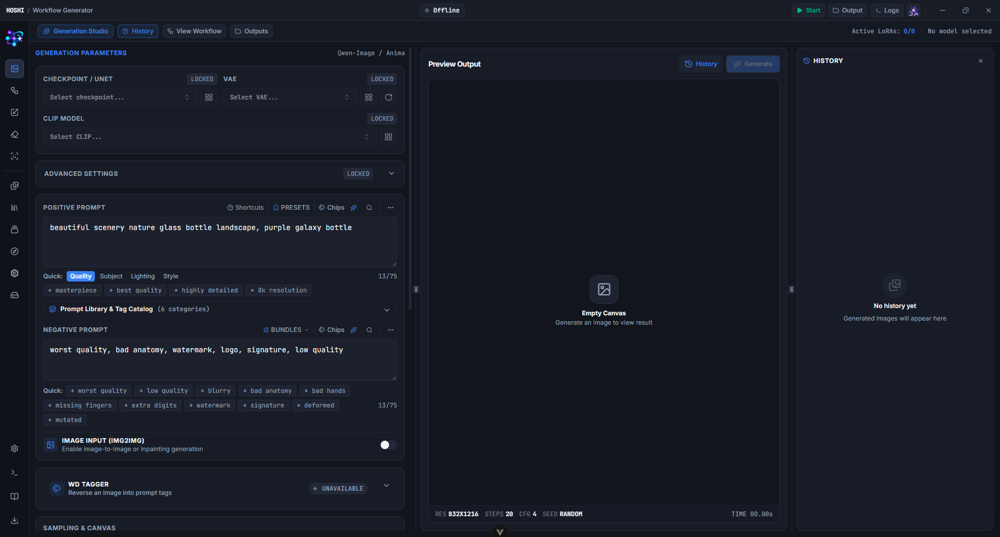
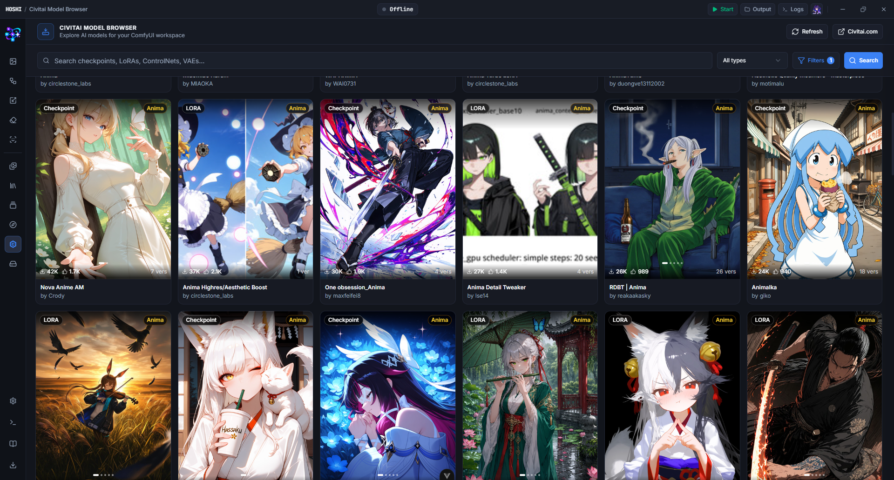

# Hoshi

<p align="center">
  
</p>

<p align="center">
  <strong>A standalone desktop studio for ComfyUI, built for the Anima model family.</strong>
</p>

<p align="center">
  <a href="https://github.com/Comfy-Org/ComfyUI/releases/tag/v0.33.1">= v0.33.1"/></a>
  
  
  
  
</p>

> **Work in Progress**: Hoshi is currently under active development. Features and interfaces are subject to change, and you may encounter bugs or incomplete functionality.

## Overview

**Hoshi** (codename _Koharu_) is a desktop frontend for ComfyUI aimed at creators who want to generate images with the **[Anima](https://huggingface.co/circlestone-labs/Anima)** model family without building or maintaining node graphs. It launches and supervises your local ComfyUI, builds the workflow graph for you on every run, and wraps generation, post-processing, model management and reference browsing in one studio-style window.

Hoshi is a Tauri v2 (Rust) + Vue 3 application. It talks to ComfyUI over its normal HTTP/WebSocket API plus a small bridge custom node that Hoshi installs automatically.

## Features

### Generate

- **Workflow Generator** — txt2img, img2img and inpainting (with a built-in mask painter) for Anima, with resolution presets, sampler/scheduler selection, seed control and variation seeds.
- **Prompting** — tag autocomplete backed by a local suggestion catalog and the ComfyUI server, prompt chips, weight hotkeys, find-in-prompt, negative prompt bundles and `{a|b}` dynamic prompts resolved from the seed.
- **LoRA chain** — stack LoRAs with per-item strength and pull trigger words from Civitai sidecars or safetensors metadata.
- **Pipeline stages** — optional FaceDetailer pass, Ultimate SD Upscale, plain model upscaling and a PostFX pipeline (adjust/style stages); advanced model transforms (AuraFlow sampling, RenormCFG, CacheDiT, LLLite).
- **Live output** — streaming latent previews, progress, batch queueing, generation history with "reuse settings", and the elapsed-time HUD.

### Post-process

- **Upscaler** — standalone upscale-model or Ultimate SD Upscale tool with before/after comparison.
- **Face Detailer** — run the Impact Pack detailer on any image.
- **Remove Background** — RMBG and BiRefNet modes with mask settings.
- **WD Tagger** — tag an image into a ready-to-use prompt.

### Browse

- **Booru Gallery** — Danbooru, Gelbooru, Safebooru, AI Tag, yande.re and Konachan with per-site credentials, tag autocomplete, a post inspector and a built-in Cloudflare verification window.
- **Animadex** — explore characters and artists, and push their tags straight into the prompt.
- **Civitai** — browse models, inspect versions and samples, and download files with a background download manager.
- **Danbooru Wiki** — read tag wikis in-app with pinned pages and DText rendering.

### Manage

- **Gallery** — indexed output viewer with thumbnails, metadata search (`model:` filters, tags), A/B compare modes and a lightbox inspector.
- **Library** — prompt presets, LoRA presets and character entries (with thumbnails and notes that the assistant can read).
- **Model Manager** — indexes every ComfyUI model folder (including `extra_model_paths.yaml`), hashes files, syncs metadata and previews from Civitai, checks for updates and manages preview images.
- **Embedded ComfyUI editor** — the full ComfyUI frontend inside Hoshi, with one-click "open this generation as a workflow".
- **Server terminal** — launch/stop ComfyUI with your Python and arguments, ANSI-colored log streaming and a log drawer available on every page.

### Maya, the AI assistant

An OpenRouter-powered chat assistant that understands Anima prompting, can inspect the current prompt, search Animadex and your character library, inject prompt changes and queue generations. It also drives the inline prompt enhancer and auto-names chat sessions.

## Screenshots

### Workflow Generator

Intuitive controls for Anima model generation, prompt autocomplete, LoRA stacking, and live execution previews.



### Civitai Model Browser

Browse models, inspect versions and preview samples, with background download management.



## Requirements

### ComfyUI

- **[v0.33.1](https://github.com/Comfy-Org/ComfyUI/releases/tag/v0.33.1) or later.** Hoshi starts ComfyUI with `--enable-cors-header` and injects its bridge node (`custom_nodes/comfyui-koharu-bridge`) before every launch — no manual install needed.

### Model

- Hoshi currently targets the **[Anima](https://huggingface.co/circlestone-labs/Anima)** family. Other architectures may run but are not supported.

### External custom nodes

Generated graphs use nodes from these packs. Install them into your ComfyUI `custom_nodes/` directory:

- [yet_essential](https://github.com/KidiXDev/yet_essential)
- [ComfyUI-WD-Timm-Tagger](https://github.com/bedovyy/ComfyUI-WD-Timm-Tagger)
- [ComfyUI_UltimateSDUpscale](https://github.com/ssitu/ComfyUI_UltimateSDUpscale)
- [ComfyUI-Impact-Pack](https://github.com/ltdrdata/ComfyUI-Impact-Pack)
- [ComfyUI-Impact-Subpack](https://github.com/ltdrdata/ComfyUI-Impact-Subpack)
- [ComfyUI-RMBG](https://github.com/1038lab/ComfyUI-RMBG)

## Install

Windows builds are published on the [Releases](https://github.com/KidiXDev/hoshi/releases) page as an NSIS installer (`Hoshi_<version>_windows_x64-setup.exe`) and a portable zip (`Hoshi_<version>_windows_x64_portable.zip`). The Settings → About page can check for updates.

On first run, open **Settings → ComfyUI** and point Hoshi at your ComfyUI folder (or portable root) and Python executable, then start the server from the titlebar.

## Development

### Prerequisites

- [Bun](https://bun.sh)
- [Rust & Cargo](https://www.rust-lang.org/tools/install) (stable)
- [Tauri v2 prerequisites](https://v2.tauri.app/start/prerequisites/) for your OS

### Setup

```bash
git clone https://github.com/KidiXDev/hoshi.git
cd hoshi
bun install
```

### Commands

```bash
bun run tauri dev      # full desktop app
bun run dev            # vite only (Tauri invoke calls fail in a plain browser)
bun run lint           # oxlint
bun run typecheck      # vue-tsc --noEmit
bun test               # bun:test suites under src/
bun run format         # prettier
cargo check --manifest-path src-tauri/Cargo.toml
bun run tauri build    # production bundle
```

Pushing a `v*` tag runs the release workflow (Windows NSIS + portable zip).

### Naming

- **Hoshi** is the brand — anything a user reads. It lives in `src/lib/brand.ts` (frontend), `productName` in `src-tauri/tauri.conf.json` (Rust reads it through `package_info()`), `.github/workflows/release.yml` and this README.
- **Koharu** is the codename — package/crate names, the Tauri identifier, URI schemes (`koharu-image://`, …), bridge endpoints (`/koharu/*`), the `comfyui-koharu-bridge` custom node and other machine-facing identifiers. These never change with the brand.

## License

This project is licensed under the [GNU General Public License, version 3](LICENSE).
